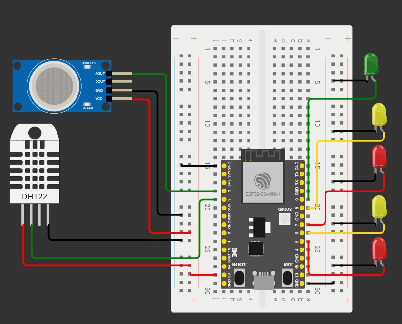

# Posttest 2 Praktikum IoT A: Smart House Monitoring dan Kontrol Berbasis ESP32 dan Telegram Bot

## Deskripsi

Posttest 2  mengenai pembuatan sistem Internet of Things (IoT) berupa Smart House yang dapat dikontrol dan dimonitor menggunakan platform Telegram Bot. Sistem ini menggunakan ESP32 sebagai mikrokontroler utama yang terhubung dengan beberapa LED sebagai sistem pencahayaan serta dua sensor yaitu DHT11 untuk membaca suhu dan kelembapan, serta MQ-2 untuk mendeteksi kebocoran gas. Seluruh perangkat dapat dikontrol secara real-time melalui Telegram Bot menggunakan koneksi Wi-Fi.

 

Sistem Smart House ini memiliki konsep pembagian akses untuk setiap anggota kelompok. Setiap anggota memiliki satu LED pribadi yang hanya dapat dikontrol oleh pemiliknya masing-masing. Selain itu, terdapat satu LED utama yang berfungsi sebagai lampu ruang tamu dan dapat dikontrol oleh seluruh anggota kelompok. Sistem ini juga dilengkapi dengan fitur monitoring suhu dan kelembapan ruangan menggunakan sensor DHT11 yang dapat diakses kapan saja melalui Telegram Bot.

 

Sistem menggunakan sensor MQ-2 untuk mendeteksi kebocoran gas. Jika kadar gas melebihi ambang batas yang telah ditentukan, maka Telegram Bot akan secara otomatis mengirimkan notifikasi peringatan ke grup Telegram. Ketika kondisi kembali normal, sistem juga akan mengirimkan notifikasi bahwa kondisi sudah aman.

## Daftar Isi

* [Deskripsi](#deskripsi)
* [Komponen yang Digunakan](#komponen-yang-digunakan)
* [Board Schematic](#board-schematic)
* [Anggota Kelompok](#anggota-kelompok)

---

## Komponen yang Digunakan

* **ESP32**
* **Breadboard**
* **Kabel Jumper**
* **5 Buah LED**
* **Sensor DHT11**
* **Sensor MQ-2**

---

## Board Schematic

### Penjelasan

Rangkaian menggunakan ESP32 sebagai pengendali utama yang terhubung dengan lima buah LED serta dua sensor yaitu DHT11 dan MQ-2. Empat LED digunakan sebagai lampu pribadi anggota kelompok dan satu LED digunakan sebagai lampu utama ruang tamu. Sensor DHT11 digunakan untuk membaca suhu dan kelembapan ruangan, sedangkan sensor MQ-2 digunakan untuk mendeteksi kebocoran gas di lingkungan.

### Konfigurasi Pin

| Komponen     | Keterangan              | Pin ESP32 |
| ------------ | ----------------------- | --------- |
| LED A        | Lampu pribadi anggota A | GPIO 5    |
| LED B        | Lampu pribadi anggota B | GPIO 6    |
| LED C        | Lampu pribadi anggota C | GPIO 7    |
| LED D        | Lampu pribadi anggota D | GPIO 8    |
| LED Utama    | Lampu ruang tamu        | GPIO 9    |
| Sensor DHT11 | Suhu dan kelembapan     | GPIO 3    |
| Sensor MQ-2  | Deteksi kebocoran gas   | GPIO 4    |

---

##  Anggota Kelompok

- **Muhammad Arya Fayyadh Razan** - 2309106010 - *Konfigurasi Telegram Bot* 
- **Ahmad Zuhair Nur Aiman** - 2309106025 - *Perakitan rangkaian*
- **Injil Karepowan** - 2309106028 - *Pemrograman ESP32 (coding)*
- **Annisa Rosaliyanti** - 2309106127 - *Perakitan rangkaian*
